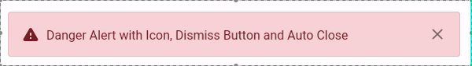

| Default                                                    | isDismissable                                                          | autoCloseDuration                                                              |
| ---------------------------------------------------------- | ---------------------------------------------------------------------- | ------------------------------------------------------------------------------ |
|  |  |  |

[`bootstrap_alert`](https://pub.dev/packages/bootstrap_alert) package helps to show some alerts to users. This package was inspired by [Bootstrap](https://getbootstrap.com/).

## Getting started

Add the package in `pubspec.yaml`.

```yaml
dependencies:
    bootstrap_alert: latest
```

## Usage


```dart
BootstrapAlert(
    visible: true,
    status: AlertStatus.primary,
    text: 'Default Primary Alert',
),
```

---


```dart
BootstrapAlert(
    visible: true,
    status: AlertStatus.warning,
    leadingIcon: AlertIcons.warning,
    text: 'Warning Alert with Icon',
),
```

---


```dart
BootstrapAlert(
    visible: true,
    status: AlertStatus.success,
    leadingIcon: AlertIcons.success,
    isDismissible: true,
    text: 'Success Alert with Icon',
),
```

---


```dart
BootstrapAlert(
    visible: true,
    status: AlertStatus.danger,
    leadingIcon: AlertIcons.warning,
    isDismissible: true,
    autoCloseDuration: Duration(seconds: 1),
    text: 'Danger Alert with Icon, Dismiss Button and Auto Close',
),
```

---


```dart
BootstrapAlert(
    visible: true,
    text: 'Danger Alert with Icon, Dismiss Button and Auto Close',
    borderRadius: BorderRadius.only(
        topLeft: Radius.circular(36),
        bottomRight: Radius.circular(36),
    ),
),
```

---


```dart
BootstrapAlert(
    visible: true,
    text: 'Danger Alert with Icon, Dismiss Button and Auto Close',
    padding: EdgeInsets.all(4),
),
```